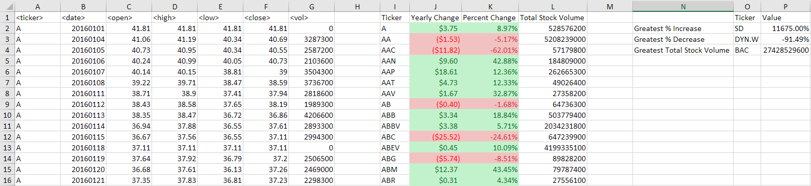
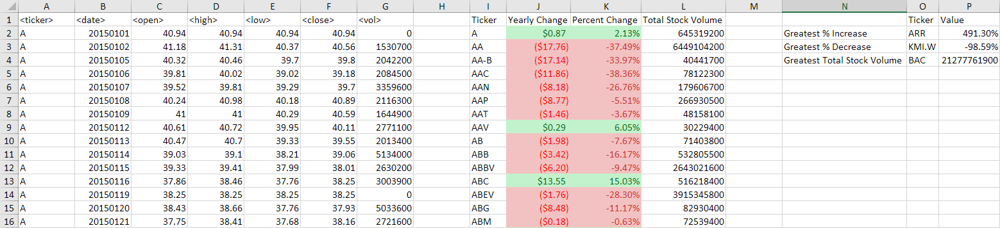
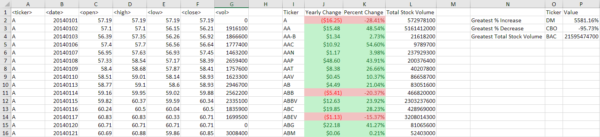

# The VBA of Wall Street

## Background

In this project, VBA scripting will be used to analyze real stock market data.

### Files

- [Test Data](Resources/alphabetical_testing_MBM.xlsm) - This file was used while developing the VBA scripts. You can run the VBA scripts against this file to see the results faster than running through the larger Stock Data file.

- [Stock Data](Resources/Multiple_year_stock_data.xlsm) - Run VBA scripts on this data to generate the final report.

### Stock market analyst

## Project Details

- This VBA a script will loop through all the stocks for one year and output the following information:

  - The ticker symbol.

  - Yearly change from opening price at the beginning of a given year to the closing price at the end of that year.

  - The percent change from opening price at the beginning of a given year to the closing price at the end of that year.

  - The total stock volume of the stock.

  - Conditional formatting that will highlight positive change in green and negative change in red.

  - Return the stock with the "Greatest % increase", "Greatest % decrease" and "Greatest total volume". The solution will look as follows:

- Here is a look at the reults

  - 2016 

  - 2015 

  - 2014 

- Use the buttons to run the VBA script on the current active worksheet or run the VBA script against all the worksheets in the workbook.

## Contents

- Uploaded to Github:

  - A screen shot for each year of your results on the Multi Year Stock Data.

    - [2016_screenshot](Images/2016_screenshot.png)
    - [2015_screenshot](Images/2015_screenshot.png)
    - [2014_screenshot](Images/2014_screenshot.png)

  - VBA Scripts as separate file. [TickerProcessor.vbs](Resources/TickerProcessor.vbs)

  - README.md file.

---
